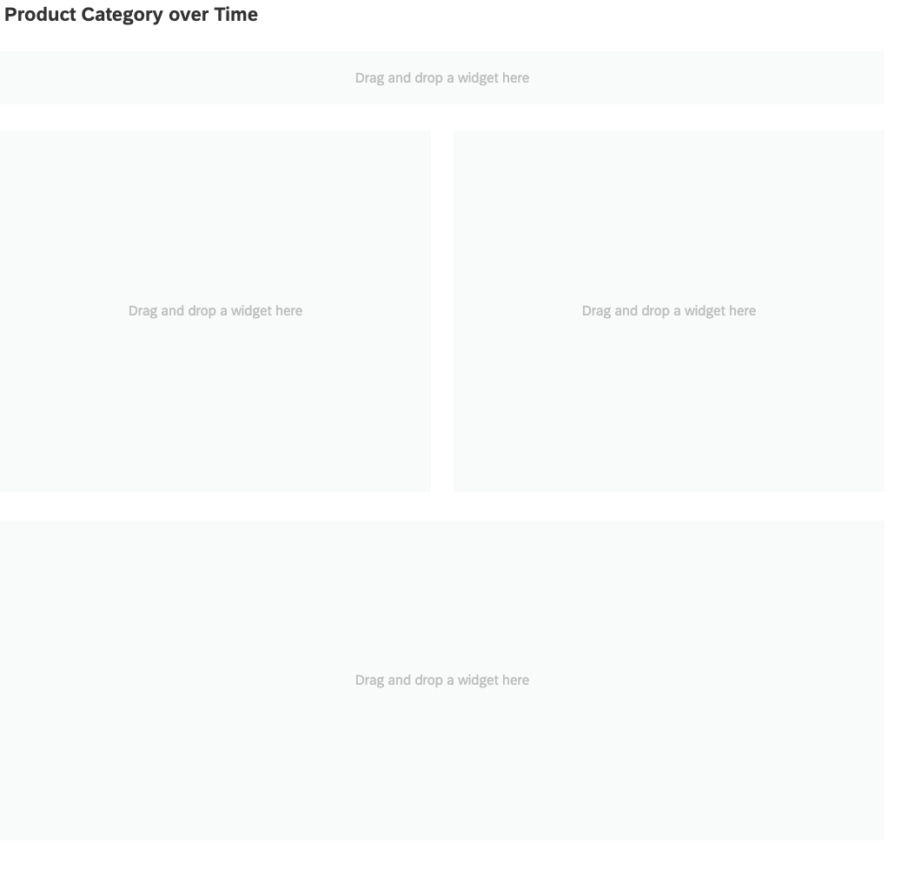
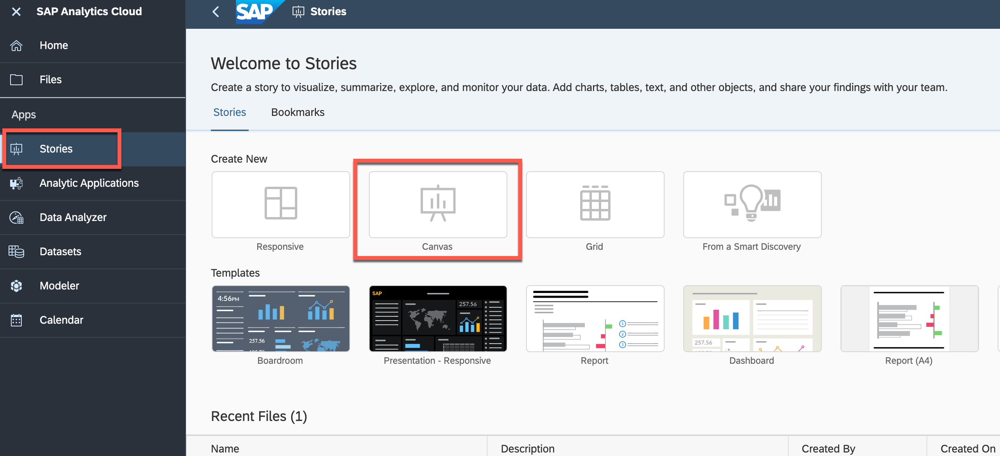
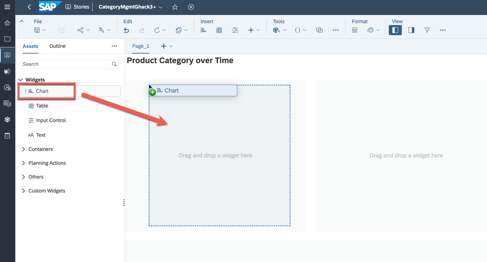
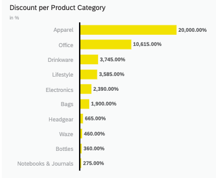
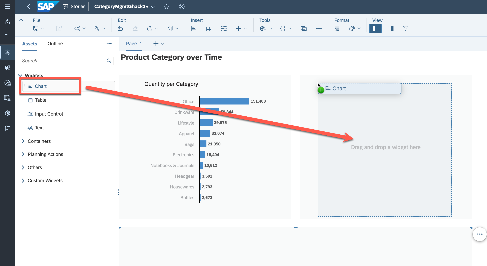
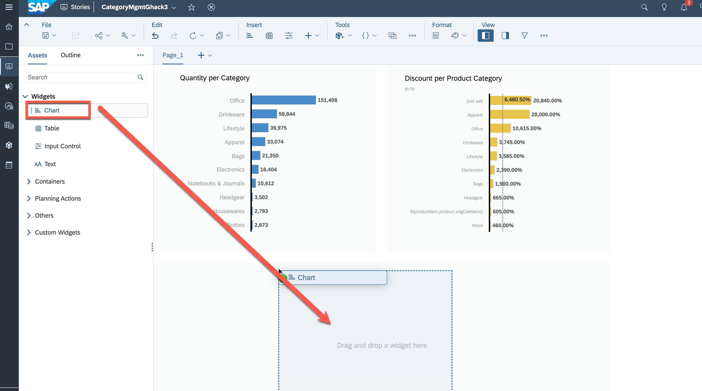
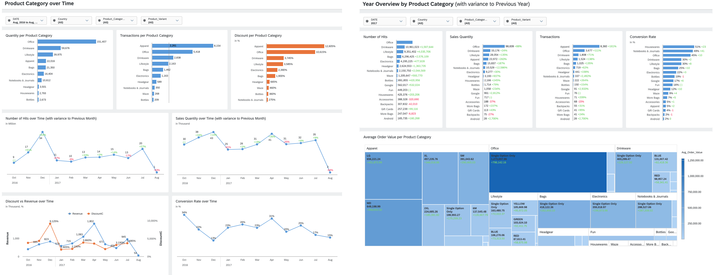

# Exercise 2 - Create a Category Management Dashboard on SAP Analytics Cloud

This exercise will focus on leveraging previously created views to create rich Category Management reports in SAP Analytics Cloud. By integrating these data sources, the reports will allow for powerful data analysis and visualization of the sales performance of different product categories. The information gathered from these reports can be used to make informed decisions about product assortment, pricing, and promotions. The use of Big Query and SAP source systems will ensure that the data used in these reports is accurate, up-to-date, and consistent, providing a solid foundation for effective Category Management decision-making.

## Exercise 2.1 Creating the Layout for the Category Management Dashboard

This exercise focuses on creating the layout for a Category Management Dashboard based on the displayed image. Determine the appropriate size and placement of each component to ensure a clear and concise presentation of the data.

  

  
Solution- Exercise 2.1

1. 👉 Open the [SAP Analytics Cloud](https://techedsac-da266.ap11.hcs.cloud.sap/sap/fpa/ui/app.html#/home) using the provided credentials.
   
  

2. 👉 Go to the **Stories** and create a new **Canvas**
    
    >Use the Optimized Design mode, which provides an improved experience when designing dashboards. This mode has some useful new features, but it does not include all the features that are currently supported in the Classic Design mode.
    
    

3. 👉 Drag and drop a **Text** field to give the dashboard name *"Product Category over Time"*

4. 👉 Drag and drop 4 **Panels** into the canvas to shape a layout for the charts (see the screenshot below)
 
    

## Exercise 2.2 Assigning the data from SAP Datasphere to Dashboard

This exercise focuses on adding the **"Product_Sales_Country_Discount"** view from SAP Datasphere as a data source in SAP SAC.

  
Solution- Exercise 2.2

1. 👉 Go to the **Tools** and press **Add new Data**, then select **Data from an existing dataset or model**
    
    

2.  👉 Select the connection **SAP Datasphere** as a source, your space and the dataset
    - Connection: **PAADWC**
    - Space: **TECHED_\<USER_NO>**
    - Dataset: **Product_Sales_Country_Discount**
  
    

## Exercise 2.3 Creating the first Chart for displaying **Quantity per Product Category**

This exercise focuses on creating the first chart for displaying **"Quantity per Product Category"** in a dashboard. The purpose of this chart is to provide an overview of the product categories with the highest quantities sold (Top 10), allowing users to identify trends and opportunities for improvement.

To complete this exercise, you will need to follow these steps:

1. Select the appropriate chart type for displaying quantity by product category, such as a bar chart or a pie chart.
2. Choose the appropriate visualization settings, such as the color scheme, labels, and axes, to ensure that the data is easy to read and visually appealing.
3. Select the appropriate fields from the data source to display quantity by product category.
4. Configure any necessary filters or sorting options to ensure that the data is displayed accurately and in the desired order.

Your objective is to create a chart that accurately displays the quantity by product category in a clear and visually appealing way, allowing users to quickly identify trends and make informed decisions. Best of luck!

 

  
Solution- Exercise 2.3

After assigning the dataset, you can start building your first charts

1. 👉 Drag and drop from the left panel a **Chart** widget into the first container

   

2. 👉 Select the chart and add the following properties in a **Builder** on the right panel 
    - Measure: **Quantity**
    - Dimensions: **Product_Category_Enhanced_Ecommerce**

   

3. 👉 Click on the **...** "More Actions" and rank the **Product_Category_Enhanced_Ecommerce** as **Top 10**, to display top products per category.

   

4. 👉 Exclude the **(not set)** and **${productitem.product.origCatName}** attributes by selecting them and pressing **X**

   

5. 👉 Give some proper name ("Quantity per Product Category") and your first chart is ready

   

## Exercise 2.4 Creating another Chart for displaying **Discount per Product Category**

This exercise focuses on creating another chart for displaying **"Discount per Product Category"** in a dashboard. The purpose of this chart is to provide an overview of the product categories with the highest discounts applied, allowing users to identify trends and opportunities for improvement.

To complete this exercise, you will need to follow these steps:

1. Select the appropriate chart type for displaying quantity by product category, such as a bar chart or a pie chart.
2. Choose the appropriate visualization settings, such as the color scheme, labels, and axes, to ensure that the data is easy to read and visually appealing.
3. Select the appropriate fields from the data source to display discount by product category.
4. Configure any necessary filters or sorting options to ensure that the data is displayed accurately and in the desired order.
5. Optionally you can add a reference line for the average discount.

Your objective is to create a chart that accurately displays the discount by product category in a clear and visually appealing way, allowing users to quickly identify trends and make informed decisions. Best of luck!
 
 

  
Solution- Exercise 2.4

Similar to the previous approach create another chart to visualize the **Discount** per Product Category**

1. 👉 Drag and drop from the left panel a **Chart** widget into the secound container

   

2. 👉 Select the chart and add the following properties in a **Builder** on the right panel 
    - Dimensions: **Product_Category_Enhanced_Ecommerce**

   

3. 👉 Add a new **Calculation** as a **Measure**
    - Type: **Calculated Measure**
    - Name: **DiscountC**
    - Formula: **["AM_Product_Sales_Country_Discount":discount]** (This will be the Analytic Model Name which you created in SAP Datashpere in Exercise 1)

   

4. 👉 Format it as a **Percentage****
    > Note: Uncheck the *Use unit of underlying measures* to activate the percentage option in Scale Dropdown

   

5. 👉 Click on the **...** "More Actions" and rank the **Product_Category_Enhanced_Ecommerce** as **Top 10**, to display top products per category.

   

6. 👉 Exclude the **(not set)** and **${productitem.product.origCatName}** attributes by selecting them and pressing **X**

   

7. 👉 Give some proper name ("Discount per Product Category") and your second chart is ready. Optionally you can add a reference line for the average discount.

   

## Exercise 2.5 Creating the last Chart for displaying **Sales Quantity over Time**

This exercise focuses on creating the last chart for displaying "Sales Quantity over Time" with the variance to the previous period in a dashboard. The purpose of this chart is to provide an overview of the sales quantities over time, allowing users to identify trends and compare them to previous periods.

To complete this exercise, you will need to follow these steps:

1. Select the appropriate chart type for displaying sales quantity over time, such as a line chart or an area chart.
2. Choose the appropriate visualization settings, such as the color scheme, labels, and axes, to ensure that the data is easy to read and visually appealing.
3. Select the appropriate fields from the data source to display sales quantity over time.
4. Configure any necessary filters or sorting options to ensure that the data is displayed accurately and in the desired order.
5. Add a comparison to the previous period by calculating the variance in sales quantity for each period.

Your objective is to create a chart that accurately displays the sales quantity over time with the variance to the previous period in a clear and visually appealing way, allowing users to quickly identify trends and make informed decisions. Good luck!

 

  
Solution- Exercise 2.5

1. 👉 Drag and drop from the left panel another **Chart** widget into the bottom container

   

2. 👉 Select the chart and add the following properties in a **Builder** on the right panel 
    - Currently Selected Chart: **Line**
    - Measure: **Quantity**
    - Dimensions: **DATE** and set Hierarchy to **Level 3**

   

3. 👉 Add a new **Variance** to compare the **Current Time Interval** with the **Previous Time Interval** by using the properties displayed below

   

4. 👉 Give some proper name ("Sales Quantity over Time (with variance to Previous months)") and your last chart is ready

   

## Exercise 2.6 Creating **Input Controls** for the dashboard

The challenge is to create "Input Controls" for the dashboard to filter the data displayed on the dashboard. Input Controls allow users to interact with the dashboard and dynamically change the data displayed based on their preferences.

To complete this challenge, you will need to follow these steps:

1. Determine the appropriate fields to be used for filtering, such as "Product Category", "Product Variant", "Country" and "Date".
2. Choose the appropriate type of input controls, such as a drop-down list, a radio button, or a date range selector.
3. Configure the input controls to interact with the dashboard's data sources. This can be done by mapping the input control to the appropriate fields in the data source.
4. Set up the input control to provide options to the users to filter the data. For example, if the input control is a date range selector, the user should be able to select a specific range of dates to view.

Your objective is to create input controls that allow users to filter the data displayed on the dashboard based on their preferences, such as selecting a specific product category or country. The input controls should be intuitive and easy to use, and should be designed to enhance the user's experience and facilitate their decision-making process. Best of luck!

  
Solution

Finally, after having the charts, you can add some input controls to filter the data displayed on the dashboard 

1. 👉 Drag and drop from the left panel **Input Control** widget into the top container

   

2. Choose the **DATE** as a dimension and give a fixed range for the filter

   

3. Repeat steps 1 and 2 to create three other **Input Controls**
   
   - Input control for filtering the **Country**
   - Input control for filtering the **Product Category**
   - Input control for filtering the **Product Variant**

   

    After defining those filters you can filter the dashboard by country, time, product category, and product variant. This allows for deeper insights into the data by allowing you to view specific subsets of information based on your needs.

4. Save the **Story** e.g. with a name "TECHED_\<USER_NO>"

## Result

Below you can find the final result of your dashboard:

 

You can add more charts to the dashboard at any time to extend its capabilities and better meet the business requirements. The SAP Analytics Cloud platform offers a wide range of chart options, making it possible to display data in a variety of ways to suit different needs and preferences.

>An example of more extensive dashboard can be found below

 
## Summary

You've now created your first dashboard using SAP Analytics Cloud to gain insights into sales data based on different product categories. Through this hands-on exercise, you learned how to use the platform to create a simple dashboard to analyze and visualize the data. 

