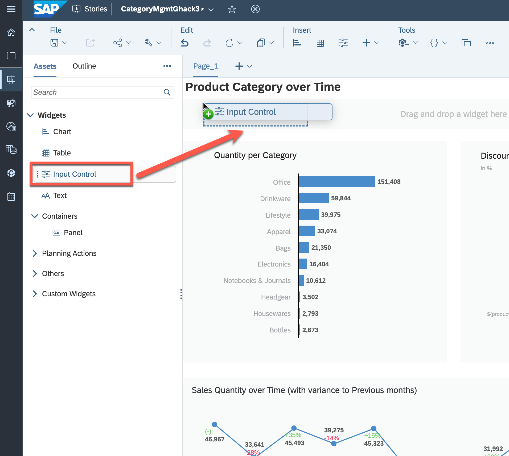
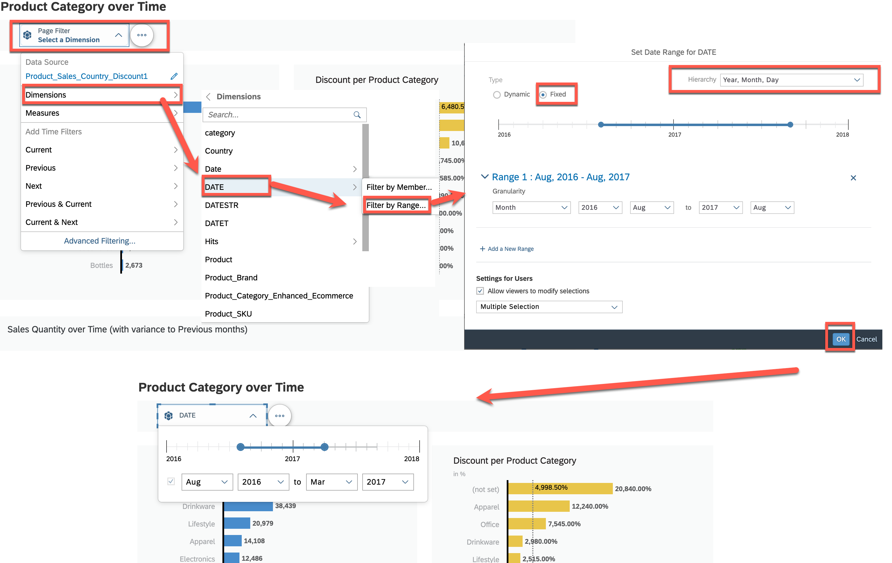
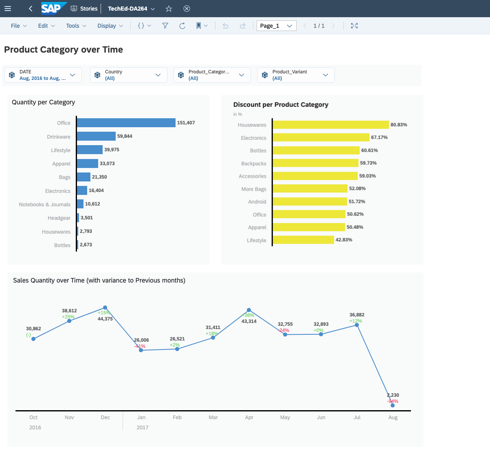

## Exercise 6- Creating **Input Controls** for the dashboard

This exercise focusses on creating "Input Controls" for the dashboard to filter the data displayed on the dashboard. Input Controls allow users to interact with the dashboard and dynamically change the data displayed based on their preferences.

To complete this challenge, you will need to follow these steps:

1. Determine the appropriate fields to be used for filtering, such as "Product Category", "Product Variant", "Country" and "Date".
2. Choose the appropriate type of input controls, such as a drop-down list, a radio button, or a date range selector.
3. Configure the input controls to interact with the dashboard's data sources. This can be done by mapping the input control to the appropriate fields in the data source.
4. Set up the input control to provide options to the users to filter the data. For example, if the input control is a date range selector, the user should be able to select a specific range of dates to view.

Your objective is to create input controls that allow users to filter the data displayed on the dashboard based on their preferences, such as selecting a specific product category or country. The input controls should be intuitive and easy to use, and should be designed to enhance the user's experience and facilitate their decision-making process. Best of luck!

### Step by Step Solution Guide

Finally, after having the charts, you can add some input controls to filter the data displayed on the dashboard 

1. 👉 Drag and drop from the left panel **Input Control** widget into the top container

   

2. Choose the **DATE** as a dimension and give a fixed range for the filter

   

3. Repeat steps 1 and 2 to create three other **Input Controls**
   
   - Input control for filtering the **Country**
   - Input control for filtering the **Product Category**
   - Input control for filtering the **Product Variant**

   

    After defining those filters you can filter the dashboard by country, time, product category, and product variant. This allows for deeper insights into the data by allowing you to view specific subsets of information based on your needs.

4. Save the **Story** e.g. with a name "TECHED_\<USER_NO>"

## Result

Below you can find the final result of your dashboard:

 

You can add more charts to the dashboard at any time to extend its capabilities and better meet the business requirements. The SAP Analytics Cloud platform offers a wide range of chart options, making it possible to display data in a variety of ways to suit different needs and preferences.

## Congratulations!

Congratulations! You've now created your first dashboard using SAP Analytics Cloud to gain insights into sales data based on different product categories. Through this hands-on exercise, you learned how to use the platform to create a simple dashboard to analyze and visualize the data. 

